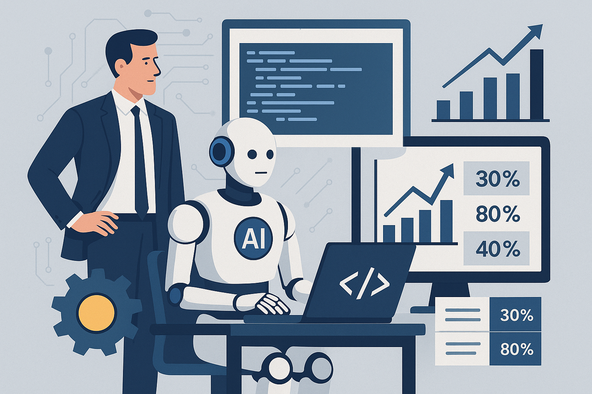

# **Die KI-Revolution in der Softwareentwicklung: Fluch oder Segen für Unternehmen und Ingenieure?**

## **Executive Summary: Wenn der Code plötzlich von selbst schreibt**

Stell dir vor, Software entsteht fast wie von Zauberhand. Genau das versprechen uns Künstliche Intelligenz (KI), insbesondere Large Language Models (LLMs) und autonome KI-Agenten. Sie sind nicht mehr nur nette Helferlein, sondern echte Game Changer, die die Softwareentwicklung auf den Kopf stellen. Für Unternehmen klingt das nach einem Traum: mehr Effizienz, weniger Kosten, schnellere Innovation. Und für Softwareingenieure? Da wird's spannend\! Repetitive Aufgaben verschwinden, der Fokus verschiebt sich auf kreative, architektonische Meisterleistungen – und das erfordert natürlich ganz neue Skills.

Aber halt, ganz so einfach ist es nicht. Wo Licht ist, ist auch Schatten. Technische Stolperfallen wie KI-Halluzinationen, unerwünschte Verzerrungen und fiese Sicherheitslücken lauern. Und ethische Fragen? Die sind mindestens genauso knifflig: Wer ist verantwortlich, wenn die KI Mist baut? Wie transparent ist das Ganze? Und was passiert mit unseren menschlichen Fähigkeiten, wenn die Maschinen immer mehr übernehmen? Dieser Bericht taucht tief in diese Fragen ein und zeigt, wie man die KI-Welle reitet, ohne dabei baden zu gehen.

## **I. Einleitung: Der digitale Kollege klopft an die Tür**

Künstliche Intelligenz, angeführt von den beeindruckenden Large Language Models (LLMs) und den immer autonomer werdenden KI-Agenten, krempelt die Softwareentwicklung gerade komplett um. Was früher Science-Fiction war, ist heute Realität: Diese Technologien sind nicht mehr nur nette Gimmicks, sondern feste Bestandteile unseres Entwicklungsalltags. Sie versprechen, wie wir Software planen, bauen, testen und pflegen, von Grund auf neu zu gestalten.[^1] LLMs, diese cleveren Text-Genies auf Basis der Transformer-Architektur, können nicht nur plausibel klingende Texte erzeugen, sondern auch Code schreiben und sogar logisch denken – zumindest tun sie so.[^2]

Aber Achtung: KI-Agenten sind keine einfachen Chatbots, die nur auf Befehl reagieren. Nein, diese Burschen haben Ziele, können planen, erinnern sich an vergangene Interaktionen und agieren sogar autonom. Sie nutzen LLMs als ihr „Gehirn“ und können sich mit externen Tools verbinden.[^3] Das ist ein echter Quantensprung: Wir reden hier nicht mehr nur über die Automatisierung einzelner Klicks, sondern über die semi-autonome oder sogar voll autonome Orchestrierung ganzer Arbeitsabläufe. Für Unternehmen bedeutet das ein gigantisches Potenzial für die End-to-End-Automatisierung, aber auch eine neue Dimension der Komplexität bei der Steuerung und Überwachung. Und für uns Ingenieure? Da verschiebt sich der Fokus vom reinen Tool-Nutzer zum Manager und Kollaborateur mit autonomen Systemen, die mehrstufige Pläne ausführen können. Das erfordert eine Neubewertung von Sicherheitsprotokollen, ethischen Richtlinien und der menschlichen Aufsicht, denn diese Agenten können mit kritischen Systemen interagieren und agieren mit immer größerer Autonomie.

Dieser Bericht ist kein trockenes Lehrbuch über LLMs. Stattdessen werfen wir einen strategischen Blick auf die tiefgreifenden Auswirkungen von KI und KI-Agenten auf die Softwareentwicklung. Wir beleuchten das Ganze aus zwei Perspektiven: die der **Unternehmen**, die nach Effizienz und Innovation lechzen, und die der **Softwareingenieure**, die sich in ständig neuen Rollen und mit neuen Kompetenzanforderungen zurechtfinden müssen. Unser Ziel? Dir handfeste Erkenntnisse zu liefern, damit du dich in diesem rasanten Umfeld verantwortungsvoll anpassen und zukunftssicher aufstellen kannst.

## **II. Auswirkungen auf Unternehmen: Mehr PS, weniger Sprit und ein Turbo für Innovation**

Die Integration von KI und KI-Agenten in den Softwareentwicklungslebenszyklus (SDLC) ist wie ein Upgrade auf einen Sportwagen: Unternehmen können ihre Produktivität massiv steigern, Kosten senken, Produkte schneller auf den Markt bringen und Innovationen vorantreiben.[^1] Das ist kein kleines Feintuning, sondern ein grundlegender Paradigmenwechsel.

### **A. Der SDLC im KI-Rausch: Wo die Automatisierung zuschlägt**

KI und KI-Agenten mischen in jeder Phase der Softwareentwicklung mit und sorgen für eine umfassende Optimierung:

* **Code, der sich fast von selbst schreibt:** KI-gestützte Tools können Code-Schnipsel, Standard-Code oder sogar ganze Softwaremodule automatisch generieren – basierend auf einfachen Anweisungen oder natürlichsprachlichen Beschreibungen.[^1] Stell dir vor, GitHub Copilot oder Amazon CodeWhisperer liefern dir in Echtzeit Code-Vorschläge. Das verkürzt die Entwicklungszeit drastisch und reduziert Fehler.[^1] So können sich Entwickler auf die wirklich kniffligen und kreativen Aufgaben konzentrieren.[^7] Und das Beste: KI kann sogar bestehenden Code optimieren, indem sie Redundanzen oder Ineffizienzen aufspürt und Verbesserungsvorschläge macht.[^7]  
* **Testen 2.0: Qualitätssicherung mit Röntgenblick:** KI macht die Fehlersuche zum Kinderspiel. Sie identifiziert, klassifiziert und schlägt sogar Behebungsvorschläge für Fehler vor.[^1] Durch das Erkennen von Mustern und das Analysieren historischer Daten kann KI Fehler sogar proaktiv vorhersagen – Risikominimierung, bevor der Ärger überhaupt beginnt\![^1] KI-gestützte Testautomatisierung ist schneller und umfassender als jede manuelle Methode.[^1] KI-Tools analysieren Testergebnisse, schlagen zusätzliche Testszenarien vor und optimieren Testsuiten, was die Abdeckung und Zuverlässigkeit verbessert.[^1] Das reicht von der Automatisierung der visuellen Validierung bis zur automatischen Erstellung von Testfällen.[^14] Und wenn ein Test mal wieder wegen einer Kleinigkeit fehlschlägt? KI kann Skripte "selbst reparieren", die sich an kleinere Codeänderungen anpassen und so die Testanfälligkeit minimieren.14 Bei Code-Reviews unterstützt KI, indem sie den Code auf Fehler, Schwachstellen und Optimierungspotenziale analysiert, was zu einer signifikanten Reduzierung von Bugs und Sicherheitslücken führt.[^9]  
* **Projektmanagement mit Glaskugel:** KI automatisiert Routineaufgaben im Projektmanagement, wie Fortschrittsverfolgung, Zeitplanung und Status-Updates.[^7] Sie analysiert historische Daten, um präzise Projektzeitpläne zu erstellen und die Ressourcenzuweisung zu optimieren.[^7] KI-gesteuerte prädiktive Analysen sagen potenzielle Engpässe, Budgetüberschreitungen oder Ressourcenengpässe voraus.[^15] Das ermöglicht datengesteuerte Entscheidungen und reduziert die Abhängigkeit von Bauchgefühlen und Meinungen mit hohem Einfluss.[^6] KI kann sogar die Kommunikation und Zusammenarbeit in Teams durch KI-gesteuerte Chatbots und Echtzeit-Informationsaustausch verbessern.[^15]  
* **DevOps und CI/CD im Überholspur:** KI wird zum Herzstück von DevOps und CI/CD. Sie liefert Echtzeit-Einblicke in Engpässe, automatisiert Bereitstellungsprozesse und optimiert die Infrastruktur.[^1] Das Ergebnis? Schnellere Bereitstellungen, weniger Ausfallzeiten und eine bessere Abstimmung zwischen Entwicklungs- und Betriebsteams.[^1] KI-Agenten können Builds automatisieren, Tests ausführen und reibungslose Releases sicherstellen, was Continuous Integration/Continuous Deployment (CI/CD) beschleunigt.[^5]

### **B. Business-Vorteile: Der Turbo für dein Unternehmen**

Die umfassende Integration von KI in die Softwareentwicklung bringt handfeste Geschäftsvorteile und prägt strategische Entscheidungen:

* **Produktivitätsschub und Kostenexplosion – nach unten:** Die Automatisierung repetitiver manueller Aufgaben reduziert den Bedarf an menschlicher Intervention, was zu erheblichen Kosteneinsparungen und einer Effizienzsteigerung führt.[^1] McKinsey-Experimente zeigten beispielsweise eine Effizienzsteigerung von bis zu 50 % bei Aufgaben wie der Codedokumentation durch generative KI.17 Die Kosten für die Entwicklung von KI-Agenten variieren stark, von 10.000 bis 49.999 US-Dollar für einfache Chatbots bis zu über 200.000 US-Dollar für fortschrittliche, autonome Agenten.18 Ja, die Anfangsinvestitionen können hoch sein, aber die langfristigen Vorteile in Bezug auf Produktivität und reduzierten manuellen Aufwand sollen diese Kosten überwiegen.21  
* **Schneller am Markt, früher beim Kunden:** KI verkürzt den gesamten Produktentwicklungszyklus, von der Strategie bis zur Bereitstellung, indem sie zeitaufwändige Routineaufgaben automatisiert.6 Das ermöglicht Teams, mehrere Produktiterationen zu erstellen, die Marktanpassung zu verbessern und schneller auf Benutzerfeedback und Marktveränderungen zu reagieren.6 Durch die Integration fragmentierter Datenquellen aus Kundenfeedback und Produktnutzung hilft KI dabei, Produkte von Anfang an auf den Kundennutzen auszurichten, was zu einer früheren Wertrealisierung führt.[^6]  
* **Innovation, Personalisierung und UX-Design – KI macht's möglich:** KI beflügelt die Kreativität und ermöglicht innovativere Softwarefunktionen, Designs und Benutzererfahrungen.[^1] Sie kann die UI-Generierung automatisieren und Benutzererfahrungen basierend auf Verhaltensdaten personalisieren.[^1] KI beseitigt die starre Trennlinie zwischen der Identifizierung von Marktchancen und der Prüfung der Machbarkeit von Ideen, indem sie schnelles Prototyping und automatisiertes A/B-Testing ermöglicht, was zu mehr Experimenten führt.[^6]  
* **Eigenentwicklung vs. Fremdkauf: KI mischt die Karten neu:** KI-Agenten können die Entscheidung zwischen Eigenentwicklung und Fremdkauf beeinflussen, indem sie die Entwicklungs- und Betriebskosten senken.[^26] Das ermöglicht es Unternehmen, maßgeschneiderte Lösungen schneller zu entwickeln und gleichzeitig sicherzustellen, dass Daten intern bleiben, wodurch eine Grundlage für digitale Innovationen geschaffen wird.[^26]

Die Analyse der Auswirkungen von KI auf Unternehmen zeigt eine Entwicklung hin zu einer "Knowledge as a Service"-Wirtschaft. Das geht weit über die bloße Verfügbarkeit von Rohdaten hinaus. KI ist in der Lage, Daten aus der anfänglichen Kundenforschung, Telemetrie, Service-Ticket-Daten und Support-Feedback zusammenzuführen, um den End-to-End-Einfluss zu verfolgen.[^6] Sie kann auch Echtzeit-Kundeninput, Social-Media-Stimmung und Wettbewerbsforschung zusammen mit historischen Daten und Markttrends integrieren.[^6] Das bedeutet: Der wahre Wert von KI für Unternehmen liegt in ihrer Fähigkeit, disparate, fragmentierte Datenquellen in kohärentes, umsetzbares und vertrauenswürdiges Wissen zu verwandeln. Diese Transformation von Daten in nutzbares Wissen, das bei Bedarf verfügbar ist, wird zu einem zentralen Wettbewerbsvorteil. Für Unternehmen heißt das: Investiert nicht nur in KI-Modelle, sondern auch in eine robuste Daten-Governance, Datenqualitätsinitiativen und den Aufbau interner Wissensdatenbanken, die von KI-Systemen effektiv genutzt und kontinuierlich aktualisiert werden können. Der Fokus verschiebt sich vom reinen "datengetriebenen" Ansatz hin zum "wissensgetriebenen" Ansatz, bei dem die Fähigkeit, schnell zuverlässige Erkenntnisse aus großen, komplexen Datensätzen zu gewinnen und darauf zu reagieren, von größter Bedeutung ist.

Ein weiterer wichtiger Aspekt ist die Demokratisierung der Softwareentwicklung. Die Forschung spricht von der "Demokratisierung von KI-Tools" [^1] und der "Demokratisierung der Softwareentwicklung" durch No-Code-/Low-Code-Plattformen.[^7] Das klingt super: KI senkt die Einstiegshürde für die Softwareerstellung und macht sie einem breiteren Spektrum von Benutzern zugänglich, auch solchen ohne traditionelle Programmierkenntnisse. Das ermöglicht mehr Mitarbeitern, zur Anwendungsentwicklung beizutragen und Innovationen zu beschleunigen. Aber Vorsicht: Die Benutzerfreundlichkeit senkt auch die Schwelle und die Kosten für böswillige Akteure, um Cyberangriffe, Deepfakes oder Betrugsmaschen durchzuführen.[^27] Hier entsteht eine Spannung zwischen erhöhter Zugänglichkeit und erhöhten Sicherheitsrisiken. Unternehmen müssen daher die Vorteile der demokratisierten Entwicklung strategisch mit robusten Sicherheitsmaßnahmen und Governance-Frameworks abwägen. Denn obwohl mehr Mitarbeitern die Möglichkeit gegeben wird, zur Softwareerstellung beizutragen, erhöht sich das Potenzial für unsichere oder voreingenommene Ergebnisse von weniger erfahrenen Benutzern oder die Ausnutzung zugänglicher KI durch böswillige Akteure erheblich. Das erfordert einen "Security by Design"-Ansatz, umfassende interne Richtlinien für die Nutzung von KI-Tools und eine kontinuierliche Überwachung, um Missbrauch zu verhindern und die Integrität und Sicherheit KI-generierter Lösungen zu gewährleisten.

**Tabelle 1: KI/KI-Agenten in der Softwareentwicklung: Dein Business-Booster**

| Anwendungsbereich | Spezifische KI/Agenten-Funktion | Wichtigster Vorteil für Unternehmen |
| :---- | :---- | :---- |
| Codegenerierung | Echtzeit-Vorschläge, Boilerplate-Generierung | Gesteigerte Produktivität, reduzierte Fehler, schnellere Entwicklung |
| Fehlererkennung & Debugging | Fehlerprognose, automatisierte Fehlerbehebung | Verbesserte Softwarequalität, proaktive Risikominderung |
| Testautomatisierung | Automatisierte Testfallgenerierung, Testoptimierung | Erhöhte Effizienz, bessere Testabdeckung, Kostenersparnis |
| Projektmanagement | Intelligente Zeitplanung, Ressourcenoptimierung | Schnellere Entscheidungsfindung, effizientere Ressourcenzuweisung |
| DevOps & CI/CD | Pipeline-Optimierung, automatisierte Bereitstellung | Beschleunigte Markteinführung, reduzierte Ausfallzeiten |
| UX-Design | UI-Generierung, Personalisierung | Verbesserte Benutzererfahrung, gesteigerte Innovation |
| Architekturdesign | Architektonische Empfehlungen | Optimierte Systemdesigns, schnellere Designprozesse |

## **III. Auswirkungen auf Softwareingenieure: Vom Coder zum KI-Dirigenten**

Der Aufstieg von KI und KI-Agenten automatisiert nicht nur Aufgaben, er verändert die DNA der Softwareentwicklerrollen grundlegend. Klar, die Angst vor Jobverlust ist da, aber der vorherrschende Expertenkonsens deutet eher auf eine Verschiebung der Verantwortlichkeiten hin. Das erfordert neue Skills und vor allem: eine unstillbare Lernbereitschaft.[^10]

### **A. Dein neuer Arbeitsalltag: Weniger Tippen, mehr Denken**

Die Integration von KI-Tools und Agenten krempelt den Arbeitsalltag von Softwareingenieuren ordentlich um:

* **Adieu, repetitive Code-Aufgaben\!** KI-gestützte Tools übernehmen Aufgaben wie Code-Vervollständigung, Boilerplate-Generierung, Syntaxkorrekturen und Refactoring.[^1] Das befreit Entwickler von der "Brute-Force"-Codierungsarbeit.[^31] Auch routinemäßige Projektmanagementaufgaben, wie Zeitplanung und Fortschrittsverfolgung, können von KI automatisiert werden.[^7]  
* **Hallo, höherwertige, kreative und architektonische Arbeit\!** Durch die Automatisierung von Routineaufgaben können sich Ingenieure auf die komplexeren, kritischeren und kreativeren Aspekte der Softwareentwicklung konzentrieren.[^1] Dazu gehören Produktvision, Strategieentwicklung, Konzeptentwicklung, Feature-Priorisierung [^6], Architekturentwurf und Leistungsoptimierung.[^31] Die menschliche Note bleibt für das nuancierte Benutzerverständnis und ästhetische Urteilsvermögen im Designbereich unersetzlich.[^11]  
* **Der KI-Auditor: Dein neuer Jobtitel?** KI-generierter Code ist effizient, aber er braucht immer noch menschliche Überprüfung, um Qualität, Sicherheit und die Einhaltung bewährter Verfahren sicherzustellen.[^10] Entwickler fungieren als "KI-Auditoren", die die Korrektheit debuggen und überprüfen.[^31] Das ist entscheidend, denn KI-generierter Code kann unsichere Standardeinstellungen, überprivilegierte Zugriffsmuster, mangelnde Eingabevalidierung und unzureichende Protokollierung enthalten.[^37]

### **B. Der KI-Ingenieur: Dein neues Skillset**

Um in der KI-gesteuerten Welt der Softwareentwicklung erfolgreich zu sein, müssen Ingenieure ihr Fähigkeitsprofil erweitern. Es ist Zeit für ein Upgrade\!

* **KI-/Maschinelles Lernen-Konzepte und \-Tools verstehen:** Ein grundlegendes Verständnis von ML-Modellen, Algorithmen und Frameworks (z.B. TensorFlow, PyTorch) wird unerlässlich.[^10] Dazu gehört Wissen über überwachte/unüberwachte Lerntechniken, Deep-Learning-Algorithmen (CNNs, RNNs) und NLP-Technologien.[^10] Die Vertrautheit mit KI-gestützten Codierungsassistenten (z.B. GitHub Copilot, ChatGPT) wird schnell zur Basisfähigkeit.[^31]  
* **Data Engineering, Big Data Analyse und KI-Bereitstellung (MLOps/DevOps) beherrschen:** Fähigkeiten in Datenmodellierung, Data Engineering (Datenerfassung, \-bereinigung, \-transformation) und Big Data Analyse (mit Tools wie SparkSQL, Apache Flink) sind entscheidend, da KI stark auf qualitativ hochwertige Daten angewiesen ist.[^39] Kenntnisse in KI-Bereitstellung, MLOps und DevOps-Praktiken, einschließlich Containerisierung (Docker, Kubernetes), Überwachung und Wartung der Leistung von KI-Systemen, sind unerlässlich.[^39]  
* **Kritisches Denken, Problemlösung und Anpassungsfähigkeit entwickeln:** Diese "menschlichen Vorteile" werden immer wichtiger, da KI Routineaufgaben übernimmt.[^10] Ingenieure müssen KI-Outputs kritisch bewerten, deren Einschränkungen verstehen und komplexe Probleme lösen, die KI nicht bewältigen kann.17 Anpassungsfähigkeit und kontinuierliches Lernen sind in der sich schnell entwickelnden KI-Landschaft von größter Bedeutung und erfordern, dass Ingenieure mit neuen Tools, Techniken und Fortschritten auf dem Laufenden bleiben.[^10]  
* **Zusammenarbeit, Kommunikation und Domänenexpertise verbessern:** Eine effektive Kommunikation komplexer KI-Konzepte an nicht-technische Stakeholder und eine starke Zusammenarbeit mit verschiedenen Teams (Datenwissenschaftlern, Analysten, Projektmanagern) sind unerlässlich.[^11] Domänenspezifisches Wissen bietet einen erheblichen Vorteil, da es Ingenieuren hilft, branchenspezifische Herausforderungen zu verstehen und effektivere KI-Lösungen zu entwickeln.[^10]

Die Automatisierung von Routineaufgaben durch KI führt zu einer Verschiebung des Wertangebots eines Softwareingenieurs. Die Forschung betont immer wieder, dass Ingenieure sich auf "komplexe und kritische Aspekte" [^10], "höherwertige, kreative und architektonische Arbeit" [^31] konzentrieren und "KI-Outputs kritisch bewerten" müssen.[^36] Das erfordert nicht nur technische KI-Fähigkeiten (ML, Data Engineering, MLOps), sondern auch starke nicht-technische Fähigkeiten wie kritisches Denken, Problemlösung, Anpassungsfähigkeit und Zusammenarbeit.[^10] Das Konzept des "Experten-Generalisten" [^10] entsteht, was darauf hindeutet, dass Ingenieure ein breites Verständnis des gesamten Softwareentwicklungs-Ökosystems und des Geschäftskontextes benötigen, kombiniert mit tiefgreifendem Fachwissen in spezifischen, oft KI-bezogenen Bereichen. Das bedeutet eine signifikante Transformation in der Ausbildung, Einstellung und Entwicklung von Softwareingenieuren. Bildungseinrichtungen und Unternehmensschulungsprogramme müssen sich anpassen, um diese Mischung aus technischer Tiefe und breitem strategischem Verständnis zu fördern. Für einzelne Ingenieure erfordert dies einen proaktiven Ansatz zum kontinuierlichen Lernen, der über die Beherrschung spezifischer Programmiersprachen hinausgeht und interdisziplinäres Wissen sowie einzigartig menschliche kognitive und kollaborative Fähigkeiten kultiviert.

### **C. Arbeitsplatzsicherheit: Keine Angst vor dem Roboter-Kollegen?**

Die Diskussion über die Zukunft der Arbeitsplatzsicherheit von Softwareingenieuren im Zeitalter der KI ist vielschichtig. Hier sind die Prognosen:

* **Expertenprognosen zur KI-gestützten Codierungsautomatisierung:** Die Meinungen der Experten gehen auseinander: Dario Amodei (CEO von Anthropic) prognostiziert, dass KI in 3-6 Monaten 90 % des Codes schreiben und in 12 Monaten fast die gesamte Codierung übernehmen könnte, wobei Entwickler dann Parameter festlegen würden.[^30] Arvind Krishna (CEO von IBM) ist konservativer und schätzt, dass in absehbarer Zeit eher 20-30 % des Codes von KI generiert werden, wobei er komplexe Situationen hervorhebt, in denen KI unpraktisch ist.[^30] Mark Zuckerberg (CEO von Meta) erwartet, dass KI-Agenten die Fähigkeiten durchschnittlicher Softwareentwickler erreichen werden.[^30] Google berichtet bereits, dass über 25 % des neuen Codes von KI geschrieben werden.[^30] Der Konsens ist: KI wird Softwareingenieure im nächsten Jahrzehnt eher ergänzen als vollständig ersetzen.[^10]  
* **Neue, spezialisierte KI-Rollen entstehen:** Die Nachfrage nach spezialisierten KI-Rollen nimmt zu, darunter KI-Ingenieure, Machine Learning Engineers, Datenwissenschaftler, Generative AI Engineers, Computer Vision Engineers und Rollen, die "Prompt Engineering" oder KI-spezifische Aufsicht umfassen.[^10] Auch neue Felder wie KI-Ethik und Cybersicherheit innerhalb der Softwareentwicklung entstehen.[^32]  
* **Kontinuierliches Lernen und Upskilling ist Pflicht:** Gartner prognostiziert, dass 80 % der Ingenieure bis 2027 aufgrund generativer KI ihre Fähigkeiten erweitern müssen.[^11] Kontinuierliches Lernen und Anpassungsfähigkeit sind entscheidend für Ingenieure, um erfolgreich zu sein.[^10] Unternehmen sollten in die Weiterbildung ihrer Entwickler investieren, um KI-Codierungstools effektiv nutzen zu können.[^31]

Die weitreichende Automatisierung von Codierungsaufgaben durch KI wirft Bedenken hinsichtlich des Arbeitsplatzverlusts auf.[^29] Die Forschung, insbesondere von Aura Intelligence und dem Bureau of Labor Statistics, bietet jedoch eine Gegendarstellung: "Jede größere Steigerung der Entwicklerproduktivität hat letztendlich zu einer höheren Nachfrage nach Software geführt".[^31] Trotz der wachsenden Rolle von KI prognostizieren die Projektionen weiterhin ein "signifikantes Wachstum der Softwareentwicklungsrollen bis 2033".[^31] Das deutet darauf hin, dass die Effizienzgewinne durch KI nicht zu einer Netto-Reduzierung von Arbeitsplätzen führen werden, sondern vielmehr zu einer Expansion des gesamten Softwaremarktes und der Schaffung neuer, komplexerer Möglichkeiten. Das spiegelt historische "Produktivitätsparadoxe" wider, bei denen technologische Fortschritte zunächst Ängste vor Arbeitsplatzverlust schüren, aber letztendlich zu neuen Industrien und Berufsfeldern führen. Diese Perspektive legt nahe, dass die Softwarebranche weiter expandieren wird, sich jedoch die Art der Arbeit grundlegend ändern wird. Unternehmen werden in der Lage sein, ehrgeizigere und innovativere Projekte mit potenziell kleineren, aber höher qualifizierten Teams durchzuführen. Das schafft eine starke Nachfrage nach Ingenieuren, die KI-Tools effektiv verwalten, prüfen und damit innovieren können, was zu neuen Geschäftsfeldern und einer kontinuierlichen Weiterentwicklung des Entwickler-Ökosystems führt, anstatt zu einer Schrumpfung.

**Tabelle 2: Dein Weg zum KI-Super-Ingenieur: Rollen und Skills im Wandel**

| Traditionelle Aufgabe/Rolle | KI/Agenten-Einfluss | Sich entwickelnde Rolle/Fokus | Essentielle Fähigkeiten (Technisch) | Essentielle Fähigkeiten (Nicht-Technisch) |
| :---- | :---- | :---- | :---- | :---- |
| Repetitive Codierung | Automatisierte Generierung | KI-Auditor, KI-Tool-Nutzer | ML/DL, NLP, Code-Review-Tools | Kritisches Denken, Problemlösung |
| Manuelles Testen | Verbesserte Erkennung, prädiktive Analyse | QA-Automatisierungsexperte | Testautomatisierung, Datenanalyse | Anpassungsfähigkeit, Detailorientierung |
| Grundlegendes Debugging | Intelligente Fehlerbehebung | Debugging-Spezialist, Systemanalyst | MLOps, Systemintegration, AI Security | Kontinuierliches Lernen, Kommunikation |
| Projektplanung | Intelligente Automatisierung | Projekt-Orchestrator | Daten-Engineering, Cloud-Dienste | Zusammenarbeit, strategisches Denken |
| UI/UX-Implementierung | Personalisierte Gestaltung | UX-Designer mit KI-Fokus | Generative KI, Design-Systeme | Kreativität, Nutzerverständnis |

## **IV. Die Schattenseiten der KI: Wenn der digitale Helfer zum Problem wird**

Das transformative Potenzial von KI und KI-Agenten ist riesig, keine Frage. Aber ihre weitreichende Einführung in der Softwareentwicklung birgt auch eine ganze Reihe komplexer technischer, operativer, ethischer und menschlicher Herausforderungen. Die müssen wir proaktiv angehen, wenn wir eine verantwortungsvolle und erfolgreiche Implementierung wollen.

### **A. Technische und operative Risiken: Die Tücken der digitalen Perfektion**

Die technische Komplexität und die operationellen Anforderungen von KI-Systemen bringen spezifische Risiken mit sich:

* **Halluzinationen und Ungenauigkeiten: Wenn die KI lügt wie gedruckt:** LLMs können Inhalte generieren, die faktisch falsch, inkonsistent oder erfunden sind, aber dennoch kohärent und plausibel erscheinen.[^41] Diese "Halluzinationen" untergraben die Zuverlässigkeit in realen Szenarien erheblich.[^42] Es gibt verschiedene Typen: intrinsische (inkonsistent mit internem Wissen), extrinsische (Fehlinterpretation externer Kontexte), amalgamierte (falsche Kombination von Fakten) und nicht-faktische (Widerspruch zu etablierten Fakten) Halluzinationen.[^43] Ursachen sind Wissensüberschattung, unzureichende Wissensrepräsentation, Versagen bei der Informationsgewinnung und Kontext-Fehlausrichtung.[^43]  
  * **Was tun?** Strenge Validierung und Gegenprüfung von KI-generiertem Code sind Pflicht.[^17] Strategien umfassen sorgfältiges Prompt Engineering, Feinabstimmung auf domänenspezifischen Datensätzen, Retrieval-Augmented Generation (RAG) zur Verankerung von Ausgaben in vertrauenswürdigen Wissensdatenbanken und Multi-Agenten-Interaktion zur Verifizierung.[^42] Menschliche Aufsicht ist unerlässlich, um die Plausibilität und Korrektheit zu beurteilen.[^33]  
* **Verzerrungen (Bias) und Fairnessprobleme: Der unschmeichelhafte Spiegel unserer Daten:** LLMs können gesellschaftliche Verzerrungen aus ihren Trainingsdaten erben und verstärken, was zu diskriminierenden Ergebnissen, der Perpetuierung von Stereotypen oder systematisch unterschiedlichen Ergebnissen basierend auf ethnischen Merkmalen, Geschlecht oder kulturellen Annahmen führen kann.[^49] Positionsverzerrungen, bei denen LLMs Informationen am Anfang oder Ende eines Dokuments überbetonen, sind eine weitere Form des Bias, verursacht durch Designentscheidungen wie kausales Masking und Trainingsdaten.[^54]  
  * **Was tun?** Die Kuration vielfältiger und repräsentativer Trainingsdatensätze, die Definition und Messung von Fairness-Metriken sowie eine kontinuierliche Überwachung sind entscheidend.[^51] Selektives "Pruning" spezifischer Recheneinheiten kann Verzerrungen reduzieren.[^50] Regelmäßige Audits und menschliche Überprüfung sind notwendig, um auftretende Verzerrungen zu identifizieren und zu beheben.[^36]  
* **Sicherheitslücken und Datenschutzbedenken: Wenn die KI zum Einfallstor wird:** KI-Systeme, insbesondere solche, die interne Unternehmensdaten verarbeiten oder Code generieren, können unbeabsichtigt Datenlecks verursachen.[^34] Bedenken bestehen hinsichtlich sensibler Gesundheitsinformationen [^41] und Urheberrechtsverletzungen im Zusammenhang mit Trainingsdaten, die ohne Genehmigung bezogen wurden.[^27] KI-generierter Code kann Sicherheitslücken einführen, wie unsichere Standardeinstellungen, fest codierte Geheimnisse, überprivilegierte Zugriffsmuster und mangelnde Eingabevalidierung.[^35] Angreifer können KI auch als Werkzeug für die Generierung dynamischer Malware oder zur Ausnutzung von KI-Agenten durch Prompt Injection, Zielmanipulation oder Diebstahl von Anmeldeinformationen nutzen.[^35]  
  * **Was tun?** Strenge Datenschutzmaßnahmen (Datenminimierung, Anonymisierung, Verschlüsselung), klare Richtlinien für die KI-Nutzung und der Betrieb isolierter KI-Systeme sind unerlässlich.[^34] Für Code werden mehrschichtige Sicherheitsüberprüfungsprozesse (manuelle, statische, dynamische Analyse), Policy-as-Code-Tools und Secure-by-Design-Prinzipien empfohlen.[^36] Eine kontinuierliche Überprüfung von Abhängigkeiten auf anfällige Pakete ist ebenfalls entscheidend.[^37]  
* **Hohe Rechenkosten und Infrastrukturanforderungen: Der Stromfresser im Serverraum:** Das Training und der Einsatz von LLMs und KI-Agenten sind rechenintensiv, erfordern erhebliche Rechenleistung, Speicher und führen zu hohen Betriebskosten. Auch die Inferenzkosten sind erheblich. Das kann zu hoher Latenz, langsamer Leistung oder Systemabstürzen führen, wenn die Infrastruktur unzureichend ist. Die wachsende Größe von LLMs übertrifft den Hardwarefortschritt.[^49]  
  * **Was tun?** Strategische Investitionen in Cloud-basierte oder hybride Lösungen und moderne Hardware (GPUs, TPUs) sind notwendig.[^45] Die Optimierung von Modellen für Effizienz (z.B. Mixture-of-Experts, Multi-Query Attention, FlashAttention für rechenintensive Gewinne; Rotary Positional Embeddings, Layer Normalization für rechenunabhängige Gewinne) kann helfen, den Rechenaufwand zu reduzieren.[^49]  
* **Integrationskomplexitäten mit Altsystemen: Wenn die KI auf den Dinosaurier trifft:** Viele Organisationen kämpfen mit der Integration von KI-Systemen in ihre bestehende IT-Infrastruktur, die möglicherweise nicht für die Verarbeitungsleistung, den Speicherplatz und die Skalierungsanforderungen von KI-Workloads ausgelegt ist. Altsysteme sind oft starr und regelbasiert, im Gegensatz zu flexiblen, datengesteuerten LLMs.[^60]  
  * **Was tun?** Erfordert erhebliche Anstrengungen, um die Lücke zu schließen, möglicherweise durch angepasste KI-Tools, API-Integrationen oder gestufte Integrationsstrategien.[^60] Die Analyse aktueller Prozesse zur Identifizierung optimaler Integrationspunkte ist entscheidend.[^45]

Die Untersuchung zeigt, dass viele der identifizierten Risiken nicht isoliert sind, sondern tief miteinander verbunden sind und potenzielle Kaskadeneffekte bilden. Beispielsweise führen verzerrte Trainingsdaten [^51] direkt zu verzerrten Ausgaben [^50], die, wenn sie in kritischen Anwendungen wie Personalwesen oder juristischen Entscheidungen eingesetzt werden, zu diskriminierenden Ergebnissen [^27] und erheblichen rechtlichen sowie reputativen Haftungsrisiken führen können.[^28] Ähnlich können Halluzinationen [^42] zu inkorrekten oder unsicheren Inhalten führen [^41], was das Vertrauen der Nutzer direkt untergräbt [^60] und potenziell Schaden anrichten kann. Sicherheitslücken in KI-generiertem Code [^37] können direkt zu Datenschutzverletzungen führen [^34], was wiederum regulatorische Strafen und den Verlust des Kundenvertrauens nach sich ziehen kann. Diese Verknüpfung bedeutet, dass die isolierte Behebung eines Risikos möglicherweise nicht ausreicht, wenn zugrunde liegende Kausalitäten oder nachgelagerte Auswirkungen ignoriert werden. Das erfordert eine ganzheitliche und integrierte Risikomanagementstrategie anstelle eines fragmentierten Ansatzes. Unternehmen müssen umfassende Governance-Frameworks entwickeln, die den gesamten Lebenszyklus der KI-Einführung berücksichtigen – von der Datenerfassung und Modellschulung bis hin zu Bereitstellung, Überwachung und kontinuierlicher Verbesserung – wobei funktionsübergreifende Teams zusammenarbeiten, um diese miteinander verknüpften Risiken anzugehen. Ein Versagen in einem Bereich kann sich schnell ausbreiten und Probleme im gesamten System verstärken.

### **B. Ethische, rechtliche und menschzentrierte Herausforderungen: Der moralische Kompass im KI-Sturm**

Neben den technischen Aspekten stellen sich auch tiefgreifende ethische und rechtliche Fragen. Hier wird's philosophisch – und praktisch:

* **Mangelnde Transparenz und Erklärbarkeit ("Black-Box"-Problem): Die KI erklärt sich nicht:** Viele KI-Algorithmen, insbesondere Deep-Learning-Modelle wie LLMs, funktionieren als "Black Boxes". Das bedeutet, ihre Entscheidungsprozesse sind nicht leicht erklärbar. Das schränkt das Vertrauen der Benutzer und die breitere Akzeptanz ein.[^49] Undurchsichtige Systeme können die Anfechtung von Ergebnissen verhindern.[^27]  
  * **Was tun?** Die Entwicklung erklärbarer KI-Systeme (XAI) ist eine technische Herausforderung.[^49] Die menschliche Überprüfung von KI-Outputs ist entscheidend, um Plausibilität und Korrektheit sicherzustellen.[^10]  
* **Potenzial für Abhängigkeit von KI und Kompetenzverlust: Werden wir zu faul zum Denken?** Eine übermäßige Abhängigkeit von KI bei der Codierung kann zum Verkümmern von kritischem Denken und Problemlösungsfähigkeiten bei Entwicklern führen.[^11] Das wirft Bedenken auf, dass Ingenieure eher zu "Aufsehern" als zu aktiven Entwicklern werden.[^61]  
  * **Was tun?** Unternehmen sollten kontinuierliches Lernen und Schulungen fördern, die den Einsatz von KI-Tools mit manuellen Programmierkenntnissen in Einklang bringen.[^34] Entwickler müssen nicht-routinemäßige Fähigkeiten vertiefen, die KI nur schwer replizieren kann, wie z.B. Architekturentwurf und nuancierte Problemlösung.[^31]  
* **Verantwortlichkeit und Haftung für KI-generierte Fehler: Wer ist schuld, wenn die KI patzt?** Die Bestimmung der Verantwortlichkeit, wenn ein KI-System einen Fehler macht oder Schaden verursacht (z.B. halluzinierte juristische Einreichungen, die zu Konsequenzen führen), ist eine erhebliche rechtliche und ethische Herausforderung.[^28] Die "Black-Box"-Natur erschwert die Rückverfolgung der Verantwortung.[^60]  
  * **Was tun?** Rechts- und Politikexperten schlagen vor, Unternehmen, die KI-Modelle *einsetzen* (z.B. ein Online-Händler, der LLMs für Produktempfehlungen nutzt), zur Rechenschaft zu ziehen, anstatt nur die Entwickler der KI-Modelle, da Verzerrungen kontextspezifisch sind.[^50] Klare Verantwortlichkeiten müssen auf allen Ebenen festgelegt werden.[^45]  
* **Umgang mit regulatorischen und ethischen Rahmenbedingungen: Der Gesetzgeber hinkt hinterher:** Die rasante Entwicklung der KI erfordert eine robuste regulatorische Aufsicht.[^49] Beispiele hierfür sind der EU AI Act (der einen risikobasierten Ansatz verfolgt) und US-Klagen bezüglich KI im Personalwesen.28 Ethische Überlegungen erstrecken sich auf Umweltauswirkungen (Rechenressourcen), menschliche Handlungsfähigkeit und die Verhinderung des Missbrauchs für böswillige Zwecke.[^27]  
  * **Was tun?** Unternehmen müssen LLMOps-Prozesse an regulatorische Rahmenbedingungen anpassen, einschließlich der Führung detaillierter Audit-Logs über Datenzugriffe und Modellausgaben.[^60] Die Entwicklung interner Richtlinien für die KI-Nutzung und die Sicherstellung der Einhaltung von Antidiskriminierungsgesetzen sind entscheidend.[^34]  
* **Umgang mit Benutzervertrauen und internem Widerstand: Die Angst vor dem Unbekannten:** Benutzer könnten zögern, den Ausgaben von LLMs zu vertrauen, insbesondere in sensiblen Bereichen wie Recht, Gesundheitswesen und Finanzen, wenn sie nicht verstehen können, wie und warum eine Antwort generiert wurde.[^60] Interner Widerstand von Mitarbeitern, die Arbeitsplatzverlust befürchten, ist ebenfalls ein Problem.[^29]  
  * **Was tun?** Transparenz über KI-Fähigkeiten und \-Einschränkungen, die Implementierung von Schutzmaßnahmen, der Aufbau von öffentlichem Bewusstsein und die Förderung inklusiver Debatten sind entscheidend.[^27] Für Mitarbeiter ist ein menschenzentrierter Ansatz, der sie in KI-Implementierungsänderungen einbezieht und negative Auswirkungen mindert, unerlässlich.[^48]

Ein wichtiger rechtlicher und ethischer Aspekt, der durch die Forschung, insbesondere von Stanford Law, hervorgehoben wird, ist der sich entwickelnde Ort der Verantwortlichkeit für KI-bedingte Schäden. Die Arbeit von Nyarko argumentiert, dass es aufgrund der "hochgradig kontextspezifischen" Natur von KI-Verzerrungen [^50] aus rechtlicher und politischer Sicht effektiver sein könnte, Unternehmen, die KI-Modelle in spezifischen Anwendungsfällen

*einsetzen* (z.B. ein Online-Händler, der LLMs für Produktempfehlungen nutzt), zur Rechenschaft zu ziehen, anstatt ausschließlich die Entwickler der KI-Modelle (z.B. OpenAI, Google Vision). Dieser Ansatz spiegelt sich in Regulierungsrahmen wie dem EU AI Act wider, der zusätzliche Compliance-Verpflichtungen für Unternehmen auferlegt, die KI für "Hochrisikoanwendungen" einsetzen.[^28] Das verlagert die Last der Verantwortung grundlegend von der abstrakten Schaffung des KI-Modells auf dessen konkrete Anwendung und Auswirkung. Das bedeutet eine wesentlich größere Verantwortung für Unternehmen, strenge Bias-Audits durchzuführen, Transparenz über ihre spezifische KI-Nutzung zu wahren und die Einhaltung von Antidiskriminierungsgesetzen in

*ihren jeweiligen Betriebskontexten* sicherzustellen.[^50] Es bedeutet, dass der bloße Erwerb eines KI-Modells ein Unternehmen nicht von der Verantwortung für dessen nachgelagerte Auswirkungen entbindet. Unternehmen müssen interne Expertise und Prozesse entwickeln, um KI-Tools für ihre spezifischen Anwendungsfälle kritisch zu bewerten, anzupassen und zu steuern, da sie letztendlich für die Ergebnisse haftbar sind.

**Tabelle 3: KI-Herausforderungen: Dein Leitfaden zur Risikominimierung**

| Herausforderungskategorie | Spezifische Herausforderung | Auswirkung/Konsequenz | Wichtige Minderungsstrategie |
| :---- | :---- | :---- | :---- |
| Technisch/Operativ | Halluzinationen | Unzuverlässige Ausgaben | Rigorose Validierung, RAG, Multi-Agenten-Verifizierung |
| Technisch/Operativ | Bias | Diskriminierung, unfaire Ergebnisse | Diverse Daten, Fairness-Metriken, Pruning, Audits |
| Technisch/Operativ | Sicherheit/Datenschutz | Datenlecks, Angriffe | Datenminimierung, Verschlüsselung, Policy-as-Code |
| Technisch/Operativ | Hohe Kosten/Infrastruktur | Performance-Probleme, Verzögerungen | Cloud-Lösungen, Hardware-Optimierung, Effizienz-Algorithmen |
| Technisch/Operativ | Integrationskomplexität | Projektverzögerungen | API-Integrationen, Phasenstrategien, Prozessanalyse |
| Ethisch/Menschzentriert | Mangelnde Transparenz | Fehlendes Vertrauen, Anfechtbarkeit | Erklärbare KI (XAI), menschliche Überprüfung |
| Ethisch/Menschzentriert | Kompetenzverlust | Reduzierte menschliche Fähigkeiten | Kontinuierliches Lernen, Fokus auf nicht-routinemäßige Fähigkeiten |
| Ethisch/Menschzentriert | Verantwortlichkeit | Rechtliche Probleme | Klare Haftungsregelungen, Fokus auf Anwender-Haftung |
| Ethisch/Menschzentriert | Regulierung | Marktausschluss | Compliance, interne Richtlinien, Audit-Logs |
| Ethisch/Menschzentriert | Vertrauen/Widerstand | Geringe Akzeptanz | Transparenz, Einbeziehung der Mitarbeiter, Sensibilisierung |

## **V. Empfehlungen: So navigierst du sicher durch die KI-Welle**

Um die Chancen von KI und KI-Agenten in der Softwareentwicklung voll auszuschöpfen und gleichzeitig die damit verbundenen Risiken zu minimieren, sind gezielte Strategien für Unternehmen und Softwareingenieure unerlässlich.

### **A. Für Unternehmen: Strategie, Governance und die richtigen Investitionen**

Unternehmen müssen einen proaktiven und strukturierten Ansatz verfolgen, um KI erfolgreich zu integrieren. Kein Blindflug, bitte\!

* **Strategische Implementierung:** Fangt klein an\! Beginnt mit Pilotprojekten in risikoarmen Bereichen, um Erfahrungen zu sammeln und die Wirksamkeit von KI-Lösungen zu bewerten, bevor ihr großflächig implementiert. Analysiert eure bestehenden Geschäftsprozesse, um die größten Lücken oder Routineaufgaben zu identifizieren, die durch KI optimiert werden können.[^45]  
* **Robuste Governance und Risikomanagement:**  
  * **Datenschutz und Sicherheit:** Implementiert strenge Datenschutzmaßnahmen, einschließlich Datenminimierung, Anonymisierung und Verschlüsselung.[^52] Etabliert klare Richtlinien für die KI-Nutzung im Unternehmen und schult eure Mitarbeiter im Umgang mit sensiblen Daten in KI-Systemen.[^34] Betreibt eigene, abgeschottete KI-Systeme, wo dies kritisch ist.[^35]  
  * **Qualität und Fehlerbehebung:** Entwickelt eine Routine zur Code-Überprüfung und integriert automatisierte Tests in den Entwicklungsprozess, um die Qualität von KI-generiertem Code zu verbessern und potenzielle Fehler frühzeitig zu erkennen.[^34] Behandelt KI-Code immer wie den eines Juniors – mit Review, Test und Security-Scan.[^35]  
  * **Bias und Fairness:** Nutzt diverse und repräsentative Datensätze für das Training und die Evaluierung von KI-Modellen. Implementiert Mechanismen zur Erkennung von Verzerrungen und führt regelmäßige Audits durch, um faire und inklusive Ergebnisse sicherzustellen.[^34]  
  * **Verantwortlichkeit:** Klärt die Verantwortlichkeiten für KI-Systeme klar und deutlich.[^45] Die Unternehmen, die KI-Modelle in spezifischen Anwendungsfällen einsetzen, sollten die Hauptverantwortung für deren Auswirkungen tragen.[^50]  
* **Investition in Infrastruktur und Talente:**  
  * **Infrastruktur:** Investiert in skalierbare Rechenleistung, wie moderne GPUs oder TPUs, um große Datenmengen effizient zu verarbeiten.[^45] Berücksichtigt Cloud-basierte oder hybride Lösungen, um den hohen Anforderungen an Speicher und Rechenleistung gerecht zu werden.[^55]  
  * **Personalentwicklung:** Investiert in die Schulung der Mitarbeiter, um deren Fähigkeiten im Bereich KI zu erweitern und eine interne KI-Expertise aufzubauen.[^21] Fördert kontinuierliches Lernen und Weiterbildung, die sowohl den Einsatz von KI-Tools als auch das manuelle Programmieren abdecken.[^34]

### **B. Für Softwareingenieure: Dein persönlicher KI-Survival-Guide**

Softwareingenieure müssen eine aktive Rolle bei ihrer beruflichen Weiterentwicklung einnehmen. Wer rastet, der rostet – besonders im KI-Zeitalter\!

* **Proaktives Upskilling in KI-Kompetenzen:** Erwerbt grundlegendes und fortgeschrittenes Wissen über Maschinelles Lernen (ML), Deep Learning (DL), Natural Language Processing (NLP) und Data Engineering.[^10] Macht euch mit KI-gestützten Codierungsassistenten wie GitHub Copilot und ChatGPT vertraut, denn das wird schnell zur Basisfähigkeit. Verfolgt Spezialisierungen in aufstrebenden KI-Rollen wie Generative AI Engineer oder Computer Vision Engineer.[^31]  
* **Fokus auf menschzentrierte Fähigkeiten:**  
  * **Kritisches Denken und Problemlösung:** Kultiviert die Fähigkeit, KI-Outputs kritisch zu hinterfragen, deren Einschränkungen zu verstehen und komplexe Probleme zu lösen, die KI nicht bewältigen kann.[^17]  
  * **Architektur und Design:** Konzentriert euch auf höherwertige Aufgaben wie Architekturentwurf, Leistungsoptimierung und die Entwicklung innovativer Lösungen, die menschliche Kreativität und Urteilsvermögen erfordern.[^31]  
  * **Kommunikation und Zusammenarbeit:** Verbessert eure Kommunikationsfähigkeiten, um komplexe KI-Konzepte effektiv an nicht-technische Stakeholder zu vermitteln. Fördert die interdisziplinäre Zusammenarbeit mit Datenwissenschaftlern, Fachexperten und Projektmanagern.[^11]  
  * **Domänenexpertise:** Erwerbt branchenspezifisches Wissen, um die Herausforderungen und Anforderungen bestimmter Branchen zu verstehen und effektivere KI-Lösungen zu entwickeln.[^10]  
* **Kritische Bewertung von KI-Outputs:** Geht nicht davon aus, dass von KI generierter Code oder Informationen immer korrekt sind.[^36] Überprüft KI-generierten Code sorgfältig auf Qualität, Sicherheit und Einhaltung von Best Practices.[^10] Seid euch potenzieller Verzerrungen und Halluzinationen bewusst und wendet geeignete Gegenmaßnahmen an.[^17]

## **Conclusion: Eine Zukunft, in der Mensch und Maschine Hand in Hand coden**

Die Integration von KI und KI-Agenten in die Softwareentwicklung ist ein unaufhaltsamer Tsunami, der sowohl für Unternehmen als auch für Softwareingenieure tiefgreifende Auswirkungen hat. Für Unternehmen ist das eine beispiellose Chance: Effizienzsteigerung, Kostenreduzierung und ein Turbo für Innovationszyklen. Die Automatisierung routinemäßiger Aufgaben und die Fähigkeit, aus riesigen Datenmengen umsetzbares Wissen zu generieren, werden die Produktentwicklung und Markteinführung revolutionieren. Das Ganze fördert eine "Knowledge as a Service"-Wirtschaft und demokratisiert die Softwareerstellung, erfordert aber gleichzeitig eine verstärkte Aufmerksamkeit für Sicherheit und Governance.

Für Softwareingenieure ist das keine Job-Killer-Maschine, sondern eine Transformation ihrer Rolle. Der Fokus verschiebt sich von der reinen Codierung hin zu höherwertigen, kreativen und strategischen Aufgaben. Die Nachfrage nach Ingenieuren, die KI-Tools beherrschen, diese kritisch bewerten und menschliche Fähigkeiten wie Problemlösung, Kreativität und Zusammenarbeit einbringen können, wird steigen. Die Zukunft gehört dem "Experten-Generalisten", der technisches Fachwissen mit einem breiten Geschäftsverständnis und starken zwischenmenschlichen Fähigkeiten verbindet.

Die erfolgreiche Navigation durch diese Transformation erfordert eine proaktive und ganzheitliche Strategie. Unternehmen müssen in robuste KI-Governance, Infrastruktur und die Weiterbildung ihrer Mitarbeiter investieren, um die Risiken von Halluzinationen, Verzerrungen und Sicherheitslücken zu mindern. Softwareingenieure müssen kontinuierlich lernen und ihre Fähigkeiten anpassen, um die neuen Rollen und Anforderungen zu erfüllen. Letztendlich deutet die Analyse auf eine symbiotische Zukunft hin, in der KI und menschliche Intelligenz zusammenwirken, um innovativere, sicherere und effizientere Softwarelösungen zu entwickeln. Diese Zusammenarbeit wird nicht nur die Softwareentwicklung selbst neu definieren, sondern auch neue Möglichkeiten für Wachstum und Wertschöpfung in der gesamten Wirtschaft eröffnen.

#### **Referenzen**

[^1]: The Impact of AI and Machine Learning on Software Development ..., Zugriff am Juli 9, 2025, [https://saigontechnology.com/blog/the-impact-of-ai-and-machine-learning-on-software-development/](https://saigontechnology.com/blog/the-impact-of-ai-and-machine-learning-on-software-development/)  
[^2]: \[2501.04040\] A Survey on Large Language Models with some Insights on their Capabilities and Limitations \- arXiv, Zugriff am Juli 9, 2025, [https://arxiv.org/abs/2501.04040](https://arxiv.org/abs/2501.04040)  
[^3]: KI-Agenten: Die Zukunft intelligenter Automatisierung, Zugriff am Juli 9, 2025, [https://datasolut.com/ki-agenten/](https://datasolut.com/ki-agenten/)  
[^4]: Was sind KI-Agenten? \- Automation Anywhere, Zugriff am Juli 9, 2025, [https://www.automationanywhere.com/de/rpa/ai-agents](https://www.automationanywhere.com/de/rpa/ai-agents)  
[^5]: AI Agents in Software Engineering: The Next Frontier of Development, Zugriff am Juli 9, 2025, [https://www.index.dev/blog/ai-agents-software-development](https://www.index.dev/blog/ai-agents-software-development)  
[^6]: AI-enabled software development fuels innovation | McKinsey, Zugriff am Juli 9, 2025, [https://www.mckinsey.com/industries/technology-media-and-telecommunications/our-insights/how-an-ai-enabled-software-product-development-life-cycle-will-fuel-innovation](https://www.mckinsey.com/industries/technology-media-and-telecommunications/our-insights/how-an-ai-enabled-software-product-development-life-cycle-will-fuel-innovation)  
[^7]: KI in der Softwareentwicklung | IBM, Zugriff am Juli 9, 2025, [https://www.ibm.com/de-de/think/topics/ai-in-software-development](https://www.ibm.com/de-de/think/topics/ai-in-software-development)  
[^8]: Top AI Agents for Software Development 2025 \- Prismetric, Zugriff am Juli 9, 2025, [https://www.prismetric.com/top-ai-agents-for-software-development/](https://www.prismetric.com/top-ai-agents-for-software-development/)  
[^9]: KI-Grundlagen und Softwareentwicklung \- Explicatis, Zugriff am Juli 9, 2025, [https://www.explicatis.com/blog/ki-grundlagen-softwareentwicklung](https://www.explicatis.com/blog/ki-grundlagen-softwareentwicklung)  
[^10]: Gibt es eine Zukunft für Softwareingenieure? Die Auswirkungen von ..., Zugriff am Juli 9, 2025, [https://brainhub.eu/de/library/softwareentwickler-im-zeitalter-der-ki](https://brainhub.eu/de/library/softwareentwickler-im-zeitalter-der-ki)  
[^11]: Will AI Make Software Engineers Obsolete? Here's the Reality, Zugriff am Juli 9, 2025, [https://bootcamps.cs.cmu.edu/blog/will-ai-replace-software-engineers-reality-check](https://bootcamps.cs.cmu.edu/blog/will-ai-replace-software-engineers-reality-check)  
[^12]: Is There a Future for Software Engineers? The Impact of AI \[2025\] \- Brainhub, Zugriff am Juli 9, 2025, [https://brainhub.eu/library/software-developer-age-of-ai](https://brainhub.eu/library/software-developer-age-of-ai)  
[^13]: KI-generierte Testfälle: Qualitätssicherung im Softwaretesting, Zugriff am Juli 9, 2025, [https://www.cegos-integrata.de/blog/it-blog/software-engineering-und-testing/ki-generierte-testfalle-im-softwaretesting-ein-innovativer-ansatz-fur-mehr-effizienz-in-der-qualitatssicherung](https://www.cegos-integrata.de/blog/it-blog/software-engineering-und-testing/ki-generierte-testfalle-im-softwaretesting-ein-innovativer-ansatz-fur-mehr-effizienz-in-der-qualitatssicherung)  
[^14]: The Impact of AI on Software Testing and QA Engineers \- TestDevLab, Zugriff am Juli 9, 2025, [https://www.testdevlab.com/blog/impact-of-ai-innovations-on-software-jobs](https://www.testdevlab.com/blog/impact-of-ai-innovations-on-software-jobs)  
[^15]: AI Project Management Tools: Exploring the Future of Efficiency ..., Zugriff am Juli 9, 2025, [https://www.coursera.org/articles/ai-project-management-tools](https://www.coursera.org/articles/ai-project-management-tools)  
[^16]: AI for Project Management: Tools and Best Practices | The Workstream, Zugriff am Juli 9, 2025, [https://www.atlassian.com/work-management/project-management/ai-project-management](https://www.atlassian.com/work-management/project-management/ai-project-management)  
[^17]: Mehr Produktivität mit KI-gestützter Software-Entwicklung: Der ..., Zugriff am Juli 9, 2025, [https://www.adnovum.com/de/blog/ai-software-development](https://www.adnovum.com/de/blog/ai-software-development)  
[^18]: How Much Does It Really Cost to Build an AI Agent in 2025? \- Taazaa, Zugriff am Juli 9, 2025, [https://www.taazaa.com/how-much-does-it-really-cost-to-build-an-ai-agent-in-2025/](https://www.taazaa.com/how-much-does-it-really-cost-to-build-an-ai-agent-in-2025/)  
[^19]: AI Agent Development Cost in 2025: Factors and Examples \- Biz4Group, Zugriff am Juli 9, 2025, [https://www.biz4group.com/blog/ai-agent-development-cost](https://www.biz4group.com/blog/ai-agent-development-cost)  
[^20]: OpenAI soll an KI-Agenten auf Doktoren-Niveau arbeiten – und könnte dafür richtig viel Geld verlangen \- \- t3n, Zugriff am Juli 9, 2025, [https://t3n.de/news/openai-ki-agenten-auf-doktoren-niveau-20000-dollar-im-monat-1677071/](https://t3n.de/news/openai-ki-agenten-auf-doktoren-niveau-20000-dollar-im-monat-1677071/)  
[^21]: KI Implementierungskosten 2025: Was Sie wirklich zahlen \- KMUAutomation, Zugriff am Juli 9, 2025, [https://kmuautomation.de/kuenstliche-intelligenz/ki-implementierungskosten/](https://kmuautomation.de/kuenstliche-intelligenz/ki-implementierungskosten/)  
[^22]: Ai agent development cost estimate \- Litslink, Zugriff am Juli 9, 2025, [https://litslink.com/blog/ai-agent-development-cost](https://litslink.com/blog/ai-agent-development-cost)  
[^23]: www.ibm.com, Zugriff am Juli 9, 2025, [https://www.ibm.com/think/topics/ai-in-software-development\#:\~:text=Generative%20AI%20enhances%20software%20design,speeding%20up%20the%20design%20process.](https://www.ibm.com/think/topics/ai-in-software-development#:~:text=Generative%20AI%20enhances%20software%20design,speeding%20up%20the%20design%20process.)  
[^24]: KI-Fähigkeiten, die jeder Entwickler im Jahr 2025 braucht \- Ironhack, Zugriff am Juli 9, 2025, [https://www.ironhack.com/de/blog/ki-faehigkeiten-die-jeder-entwickler-im-jahr-2024-braucht](https://www.ironhack.com/de/blog/ki-faehigkeiten-die-jeder-entwickler-im-jahr-2024-braucht)  
[^25]: AI Skills Every Developer Needs in 2025 \- Ironhack, Zugriff am Juli 9, 2025, [https://www.ironhack.com/us/blog/ai-skills-every-developer-needs-in-2024](https://www.ironhack.com/us/blog/ai-skills-every-developer-needs-in-2024)  
[^26]: Wie KI-Agenten die Software-Produktentwicklung revolutionieren ..., Zugriff am Juli 9, 2025, [https://www.netzwoche.ch/news/2025-05-30/wie-ki-agenten-die-software-produktentwicklung-revolutionieren](https://www.netzwoche.ch/news/2025-05-30/wie-ki-agenten-die-software-produktentwicklung-revolutionieren)  
[^27]: Societal Impact of Generative AI | Michigan Online, Zugriff am Juli 9, 2025, [https://online.umich.edu/collections/artificial-intelligence/short/societal-impact-of-generative-ai-/](https://online.umich.edu/collections/artificial-intelligence/short/societal-impact-of-generative-ai-/)  
[^28]: Governance of Generative AI | Policy and Society | Oxford Academic, Zugriff am Juli 9, 2025, [https://academic.oup.com/policyandsociety/article/44/1/1/7997395](https://academic.oup.com/policyandsociety/article/44/1/1/7997395)  
[^29]: Manövriert KI die Entwickler\*innen aufs Abstellgleis? Der Stand der ..., Zugriff am Juli 9, 2025, [https://www.adnovum.com/de/blog/will-ai-replace-software-engineers](https://www.adnovum.com/de/blog/will-ai-replace-software-engineers)  
[^30]: Einfluss der Künstlichen Intelligenz auf die Softwareentwicklung ..., Zugriff am Juli 9, 2025, [https://www.mind-verse.de/news/einfluss-der-kuenstlichen-intelligenz-auf-softwareentwicklung-expertenprognosen-herausforderungen](https://www.mind-verse.de/news/einfluss-der-kuenstlichen-intelligenz-auf-softwareentwicklung-expertenprognosen-herausforderungen)  
[^31]: Future of Software Engineering in an AI-Driven World \- Aura, Zugriff am Juli 9, 2025, [https://blog.getaura.ai/future-of-software-engineering-in-an-ai-driven-world](https://blog.getaura.ai/future-of-software-engineering-in-an-ai-driven-world)  
[^32]: Will AI Kill Software Engineers? Examining The Future Of Coding ..., Zugriff am Juli 9, 2025, [https://brainpod.ai/will-ai-kill-software-engineers-examining-the-future-of-coding-and-job-security-in-2030/](https://brainpod.ai/will-ai-kill-software-engineers-examining-the-future-of-coding-and-job-security-in-2030/)  
[^33]: Transforming the software development cycle with generative AI | by QuantumBlack, AI by McKinsey \- Medium, Zugriff am Juli 9, 2025, [https://medium.com/quantumblack/transforming-the-software-development-cycle-with-generative-ai-75ee99fcf19c](https://medium.com/quantumblack/transforming-the-software-development-cycle-with-generative-ai-75ee99fcf19c)  
[^34]: Herausforderungen und Risiken von KI in der Softwareentwicklung \- In4mation \- TechBlog, Zugriff am Juli 9, 2025, [https://in4mation.blog/ki-in-der-softwareentwicklung/](https://in4mation.blog/ki-in-der-softwareentwicklung/)  
[^35]: KI als IT-Sicherheitsrisiko – Chancen und Risiken für Unternehmen \- doubleSlash Blog, Zugriff am Juli 9, 2025, [https://blog.doubleslash.de/software-technologien/kuenstliche-intelligenz/teil-1-ki-als-it-sicherheitsrisiko-chancen-und-risiken-fuer-unternehmen/](https://blog.doubleslash.de/software-technologien/kuenstliche-intelligenz/teil-1-ki-als-it-sicherheitsrisiko-chancen-und-risiken-fuer-unternehmen/)  
[^36]: Chapter 3 Ethics of Using AI | AI for Efficient Programming \- Fred Hutch Data Science Lab, Zugriff am Juli 9, 2025, [https://hutchdatascience.org/AI\_for\_Efficient\_Programming/ethics-of-using-ai.html](https://hutchdatascience.org/AI_for_Efficient_Programming/ethics-of-using-ai.html)  
[^37]: Security Implications of AI Code Generation: Auditing and Hardening Generated Code, Zugriff am Juli 9, 2025, [https://www.gocodeo.com/post/security-implications-of-ai-code-generation-auditing-and-hardening-generated-code](https://www.gocodeo.com/post/security-implications-of-ai-code-generation-auditing-and-hardening-generated-code)  
[^38]: AI and Secure Code Generation | Lawfare, Zugriff am Juli 9, 2025, [https://www.lawfaremedia.org/article/ai-and-secure-code-generation](https://www.lawfaremedia.org/article/ai-and-secure-code-generation)  
[^39]: Die 13 wichtigsten KI-Ingenieur-Fähigkeiten, die du kennen musst ..., Zugriff am Juli 9, 2025, [https://www.datacamp.com/de/blog/essential-ai-engineer-skills](https://www.datacamp.com/de/blog/essential-ai-engineer-skills)
[^40]: KI im Softwaretest: Revolution oder Risiko? Wie künstliche ..., Zugriff am Juli 9, 2025, [https://www.testing-board.com/ki-im-softwaretest-revolution-oder-risiko/](https://www.testing-board.com/ki-im-softwaretest-revolution-oder-risiko/)  
[^41]: Current applications and challenges in large language models for ..., Zugriff am Juli 9, 2025, [https://pmc.ncbi.nlm.nih.gov/articles/PMC11751060/](https://pmc.ncbi.nlm.nih.gov/articles/PMC11751060/)  
[^42]: HillZhang1999/llm-hallucination-survey: Reading list of ... \- GitHub, Zugriff am Juli 9, 2025, [https://github.com/HillZhang1999/llm-hallucination-survey](https://github.com/HillZhang1999/llm-hallucination-survey)  
[^43]: (PDF) Hallucinations in LLMs: Types, Causes, and Approaches for ..., Zugriff am Juli 9, 2025, [https://www.researchgate.net/publication/385085962\_Hallucinations\_in\_LLMs\_Types\_Causes\_and\_Approaches\_for\_Enhanced\_Reliability](https://www.researchgate.net/publication/385085962_Hallucinations_in_LLMs_Types_Causes_and_Approaches_for_Enhanced_Reliability) 
[^44]: KI-Agenten: Wenn künstliche Intelligenz reale Risiken schafft \- PITSCHEK:CONSULTING, Zugriff am Juli 9, 2025, [https://pitschek.com/2025/02/07/ki-agenten-wenn-kuenstliche-intelligenz-reale-risiken-schafft/](https://pitschek.com/2025/02/07/ki-agenten-wenn-kuenstliche-intelligenz-reale-risiken-schafft/)  
[^45]: Herausforderungen der künstlichen Intelligenz: Risiken und Lösungen \- Software Aspekte, Zugriff am Juli 9, 2025, [https://software-aspekte.de/blog/herausforderungen-der-ki/](https://software-aspekte.de/blog/herausforderungen-der-ki/)  
[^46]: The Top 5 challenges implementing AI — and how to overcome them | Glide Blog, Zugriff am Juli 9, 2025, [https://www.glideapps.com/blog/challenges-implementing-ai](https://www.glideapps.com/blog/challenges-implementing-ai)  
[^47]: Mitigating the Top 10 Vulnerabilities in AI Agents \- XenonStack, Zugriff am Juli 9, 2025, [https://www.xenonstack.com/blog/vulnerabilities-in-ai-agents](https://www.xenonstack.com/blog/vulnerabilities-in-ai-agents)  
[^48]: Ethische Bedenken hinsichtlich KI: Ein wirtschaftsorientierter Leitfaden für verantwortungsvolle KI | SmartDev, Zugriff am Juli 9, 2025, [https://smartdev.com/de/ai-ethics-concerns-a-business-oriented-guide-to-responsible-ai/](https://smartdev.com/de/ai-ethics-concerns-a-business-oriented-guide-to-responsible-ai/)  
[^49]: A Comprehensive Overview of Large Language Models \- arXiv, Zugriff am Juli 9, 2025, [http://arxiv.org/pdf/2307.06435](http://arxiv.org/pdf/2307.06435)  
[^50]: Bias in Large Language Models—and Who Should Be Held ..., Zugriff am Juli 9, 2025, [https://law.stanford.edu/press/bias-in-large-language-models-and-who-should-be-held-accountable/](https://law.stanford.edu/press/bias-in-large-language-models-and-who-should-be-held-accountable/)  
[^51]: What are Ethics and Bias in LLMs? \- AI Agent Builder, Zugriff am Juli 9, 2025, [https://www.appypieagents.ai/blog/ethics-and-bias-in-llms](https://www.appypieagents.ai/blog/ethics-and-bias-in-llms)  
[^52]: Ethik und Recht in KI-Systemen: Herausforderungen und Lösungen \- Informatik Aktuell, Zugriff am Juli 9, 2025, [https://www.informatik-aktuell.de/betrieb/kuenstliche-intelligenz/ethik-und-recht-in-ki-systemen-herausforderungen-und-loesungen.html](https://www.informatik-aktuell.de/betrieb/kuenstliche-intelligenz/ethik-und-recht-in-ki-systemen-herausforderungen-und-loesungen.html)  
[^53]: The ethical dilemmas of AI | USC Annenberg School for Communication and Journalism, Zugriff am Juli 9, 2025, [https://annenberg.usc.edu/research/center-public-relations/usc-annenberg-relevance-report/ethical-dilemmas-ai](https://annenberg.usc.edu/research/center-public-relations/usc-annenberg-relevance-report/ethical-dilemmas-ai)  
[^54]: Unpacking the bias of large language models | MIT News ..., Zugriff am Juli 9, 2025, [https://news.mit.edu/2025/unpacking-large-language-model-bias-0617](https://news.mit.edu/2025/unpacking-large-language-model-bias-0617)  
[^55]: Top 5 AI Adoption Challenges for 2025: Overcoming Barriers to Success, Zugriff am Juli 9, 2025, [https://convergetp.com/2025/03/25/top-5-ai-adoption-challenges-for-2025-overcoming-barriers-to-success/](https://convergetp.com/2025/03/25/top-5-ai-adoption-challenges-for-2025-overcoming-barriers-to-success/)  
[^56]: Künstliche Intelligenz und Datenschutz | Das müssen Sie beachten\! \- Keyed GmbH, Zugriff am Juli 9, 2025, [https://www.keyed.de/blog/kuenstliche-intelligenz-und-datenschutz/](https://www.keyed.de/blog/kuenstliche-intelligenz-und-datenschutz/)  
[^57]: Sichere Softwareentwicklung mit KI \- Reply, Zugriff am Juli 9, 2025, [https://www.reply.com/de/ai-powered-software-engineering/secure-software-development-with-ai](https://www.reply.com/de/ai-powered-software-engineering/secure-software-development-with-ai)  
[^58]: AI Agents Are Here. So Are the Threats. \- Unit 42, Zugriff am Juli 9, 2025, [https://unit42.paloaltonetworks.com/agentic-ai-threats/](https://unit42.paloaltonetworks.com/agentic-ai-threats/)  
[^59]: Large language model \- Wikipedia, Zugriff am Juli 9, 2025, [https://en.wikipedia.org/wiki/Large\_language\_model](https://en.wikipedia.org/wiki/Large_language_model)  
[^60]: The Challenges of Deploying LLMs \- A3Logics, Zugriff am Juli 9, 2025, [https://www.a3logics.com/blog/challenges-of-deploying-llms/\#:\~:text=However%2C%20there%20are%20significant%20challenges,in%2Dthe%2Dloop%20systems.](https://www.a3logics.com/blog/challenges-of-deploying-llms/#:~:text=However%2C%20there%20are%20significant%20challenges,in%2Dthe%2Dloop%20systems.)  
[^61]: Werden KI-Agenten wirklich die Softwareentwicklung revolutionieren? Was ist deine Meinung? : r/AI\_Agents \- Reddit, Zugriff am Juli 9, 2025, [https://www.reddit.com/r/AI\_Agents/comments/1k8js1h/are\_ai\_agents\_really\_about\_to\_revolutionise/?tl=de](https://www.reddit.com/r/AI_Agents/comments/1k8js1h/are_ai_agents_really_about_to_revolutionise/?tl=de)  
[^62]: Rethinking LLM Advancement: Compute-Dependent and ... \- arXiv, Zugriff am Juli 9, 2025, [https://arxiv.org/pdf/2505.04075](https://arxiv.org/pdf/2505.04075)  
[^63]: KI-generierte Datenschutzrichtlinie geprüft: Sollten Sie ChatGPT verwenden? \- Termly, Zugriff am Juli 9, 2025, [https://termly.io/de/ressourcen/artikel/ai-privacy-policy-examined/](https://termly.io/de/ressourcen/artikel/ai-privacy-policy-examined/)  
[^64]: Chancen und Risiken von KI-Agenten \- bbv Software Services GmbH, Zugriff am Juli 9, 2025, [https://bbv-software.de/insights/blog/ein-ki-agent-muss-zwingend-eine-probezeit-durchlaufen/](https://bbv-software.de/insights/blog/ein-ki-agent-muss-zwingend-eine-probezeit-durchlaufen/)
